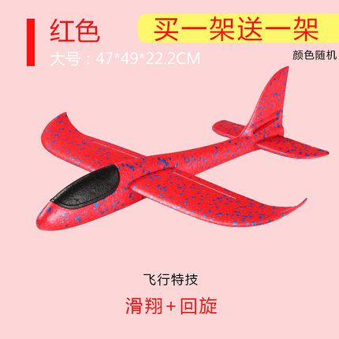
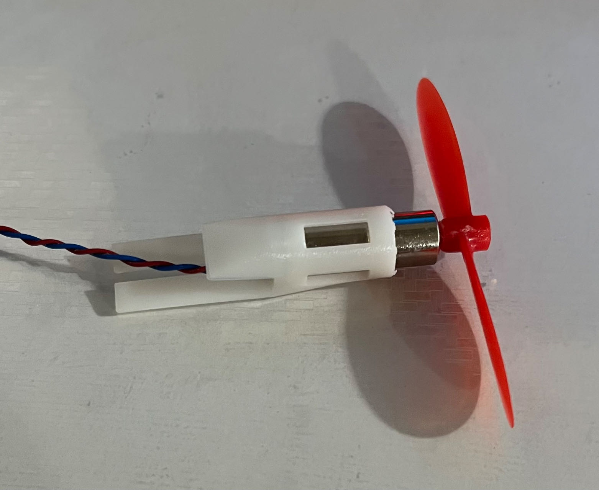
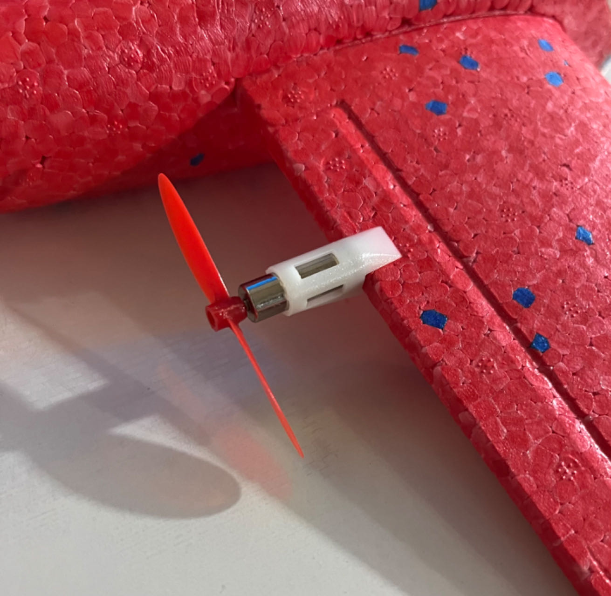
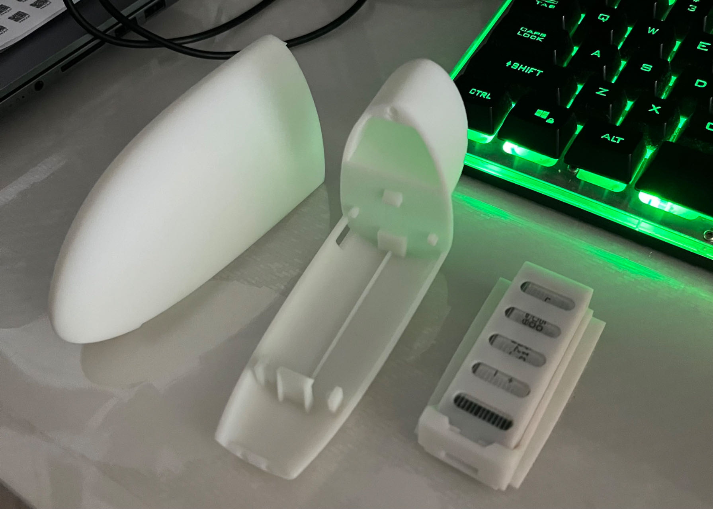
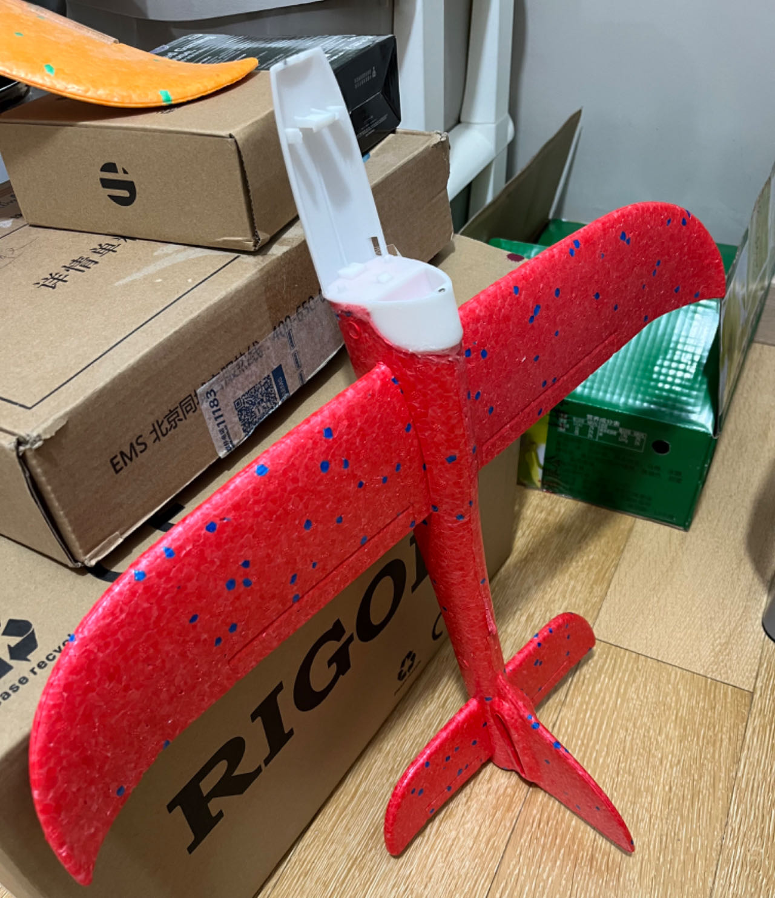
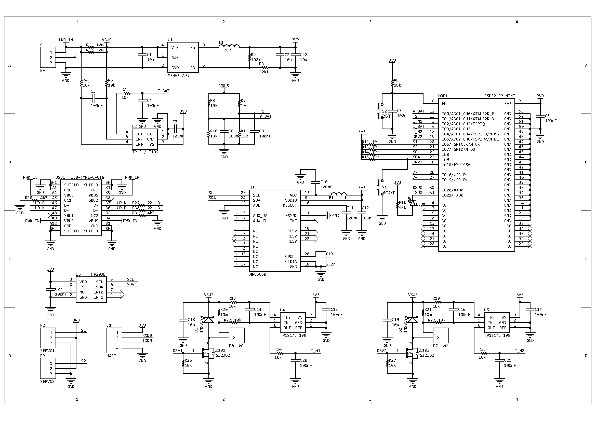
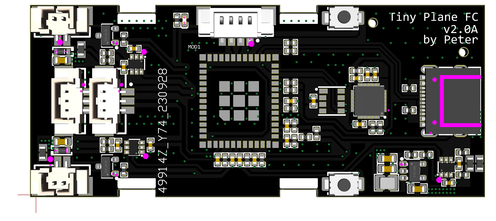

# Tiny Plane

[中文](README.md)

## Introduction

Tiny Plane is a fixed-wing aircraft flight control project aimed at DIY enthusiasts who want to build a well-controlled, long-flight-time, and highly playable fixed-wing aircraft. Currently, it is based on a 48cm wingspan hand-launched glider and uses the ESP32-C3 flight controller.

## Features

Main features of the flight controller:

- Powered by a single-cell lithium battery with a maximum operating voltage of 5.5V
- Power voltage and current sensing
- Lithium battery temperature sensing
- DCDC buck power supply with an efficiency of over 90%
- 3-axis accelerometer and 3-axis gyroscope
- Barometer for altitude measurement with an accuracy of 10cm
- 2 channels for motor control with current sensing
- 2 channels for digital input/output
- USB Type-C interface for debugging and programming
- 1 serial port for connecting GPS

Main features of the airframe:

- 49cm wingspan, 47cm length, 22cm tail
- Weight ~40g

## Hardware

The modifications mainly involve three aspects:

1. Adding motors
2. Adding batteries
3. Adding flight controllers

To achieve better control performance, it is recommended to add servos, which have not been installed yet.

### Adding Motors

Two 720 hollow cup motors are used in conjunction with 55mm propellers for rearward thrust. A motor installation seat is designed for this purpose:

Installed on the trailing edge of the wing:

### Adding Batteries and Flight Controllers

The batteries and flight controller board require a larger installation space. Therefore, a cabin is designed to accommodate the batteries and flight controller board:

The flight controller circuit board is fixed below this seat, and the battery is placed on top:

Install the cabin on the airframe:

## Flight Controller Schematic

The flight controller schematic is as follows:

## PCB

The PCB design is as follows:

## Software

[WIP] [TinyPlaneFC GitHub](https://github.com/pengwon/TinyPlaneFC)
